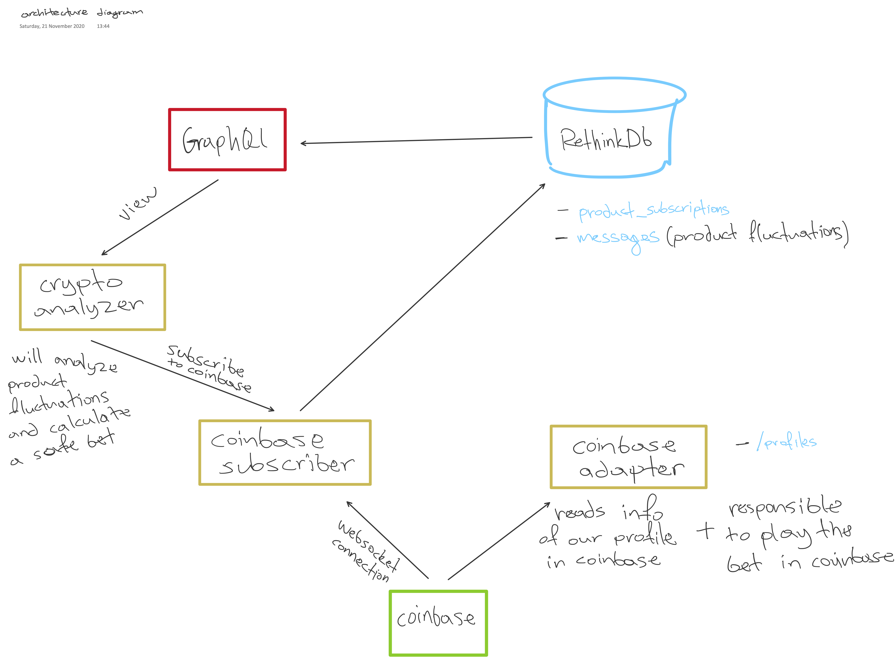

*Contains images/discussions/thoughts about architecture designs of cryptobot.*

## Contents
- [v1](#first-draft-of-cryptobot)
- [v2](#second-draft-of-cryptobot)

---

## First draft of cryptobot

## Second draft of cryptobot

We added a reverse proxy and load balancer, `nginx` to map
requests to different microservices.

### New version for the second draft of cryptobot

The new diagram adds more components to the mix, but the foundation of the architecture remains the same. Additionally, the "**crypto analyzer**" component is removed since it breaks into many smaller components for better modularity. The new components are

- Trading history
- UI
- Price analysis/predictor
- Trading interface
- Strategy assessment
- Trading simulator

Some other changes is that in the database we store both price and trading related data (as shown separately in the figure), and the "**graphql**" component becomes "**DB view interface**" for a more general name. Finally, there is greater detail in which module communicates with which.

